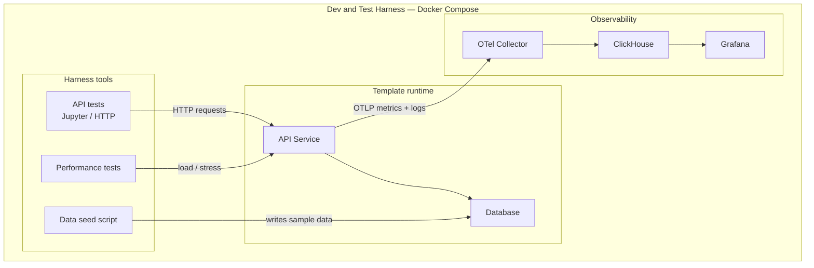

# Simple API Service Templates

This repository contains simple API service templates for different programming languages and frameworks.

Each template is a minimal **API + database**. Every template is wrapped in the same **Dev & Test harness** so you can seed data, exercise the API, load-test it, and observe it the same way regardless of language.

## Templates

- [Node.js with Postgres (TS)](nodejs-w-postgres--ts)

## Tech Stack Matrix

|         | PostgreSQL | MongoDB | SQLite | MariaDB | Redis |
| ------- | ---------- | ------- | ------ | ------- | ----- |
| Node.js | ✅          | ❌       | ❌      | ❌       | ❌     |
| Python  | ❌          | ❌       | ❌      | ❌       | ❌     |
| Ruby    | ❌          | ❌       | ❌      | ❌       | ❌     |
| Rust    | ❌          | ❌       | ❌      | ❌       | ❌     |
| Go      | ❌          | ❌       | ❌      | ❌       | ❌     |
| PHP     | ❌          | ❌       | ❌      | ❌       | ❌     |
| Java    | ❌          | ❌       | ❌      | ❌       | ❌     |

## Dev & Test Harness

The Dev & Test (D&T) harness is the shared local environment that ships with every template. It is **not** the API itself — it is the repeatable wrapper around the API: orchestrate, seed, test, observe.

Docker Compose is the single entrypoint. It brings up the template runtime (API + database) plus the harness tools so the same workflow works across languages.

| Piece                  | What it is                                         | What it does                                                                                  |
| ---------------------- | -------------------------------------------------- | --------------------------------------------------------------------------------------------- |
| Infra orchestration    | Docker Compose (+ Makefile wrappers)               | Starts, stops, and wires API, database, seeder, tests, and observability on one network       |
| Data seed script       | One-shot seeder service / SQL (or equivalent)      | Loads known sample data into the database so the API has a predictable starting state         |
| API test setup         | Jupyter notebooks (Postman-like HTTP checks)       | Functional / contract tests against live endpoints                                            |
| Performance test setup | Load / stress test config aimed at the running API | Measures latency and throughput under load                                                    |
| Observability          | OpenTelemetry Collector, ClickHouse, Grafana       | Receives OTLP metrics and logs, stores them in ClickHouse, and dashboards the running service |

## Overview diagram

The solution is the template runtime inside the harness: harness tools drive the API/DB, the service emits telemetry, Compose owns the whole stack.

